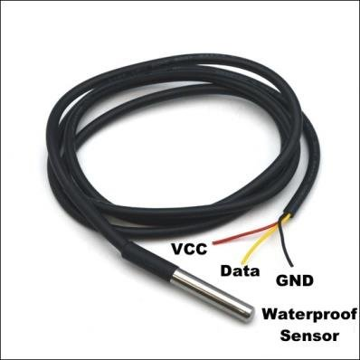
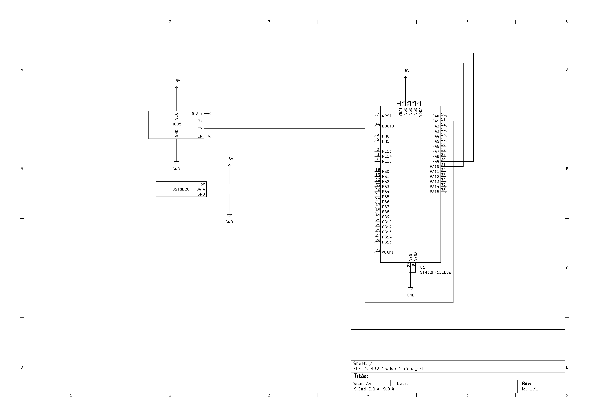
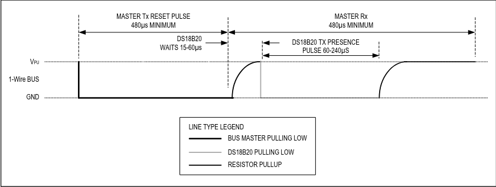

# DS18B20

This sensor stands out from other sensors and modules with absence of conventional communication protocols such as UART or I2C. Instead, it uses a uniquely designed, one-wire, half-duplex communication to send and receive data.
The sensor is outfitted with three wires: red for VCC, black for GND and yellow which serves to send/receive data. It reliably detects temperatures up to 125 degrees Celsius and stores temp. data in a 16 bit sign-extended two's complement register.





Datasheet of the DS18B20 sensor demonstrates how to receive the measured temperature:
1. send reset pulse
2. receive presence pulse from the sensor
3. Master sends skip ROM Command (0xCC, only in case of one sensor)
4. Master sends Convert T Command
5. repeat steps 1., 2. and 3.
6. send Read Scratchpad Command (0xBE)
7. read data bytes from the sensor

Since most of the terms describe events applicable only to this sensor and its datasheet, each step will be described in its own chapter.
Moreover, since all events happen in a span of microseconds, it is neccessary to create a special function to manipulate data on this scale, since the usual HAL_Delay() doesn't offer sufficient speed for these tasks.
A simple function could be made based on one of the timers of the microcontroller. I chose TIM10 as it's the most basic and offers parameter tweaking needed to create a microsecond delay.
Here is how to create a microsecond delay:
* Create a project in STM32 Cube MX or IDE
* Under Clock Configuration -> APB1 Clock choose any frequency above 1 MHz
* Under Conectivity -> USART1 -> Asynchronous choose Parameter settings
* Change the Prescaler value to the number of MHz in APB1 Clock Field and subtract 1 from it, ex. APB1 Clock = 50 Mhz -> Prescaler = 50-1 = 49
* set the register to maximum value (65535 or 0xffff)
* create a function similar to the one displayed below:
```C
void delay(uint8_t time)
{
	HAL_TIM_SET_COUNTER(&htim10, 0);
	while(HAL_TIM_GET_COUNTER(&htim10) < time);
}
```


## Reset Pulse

As shown in the datasheet, the reset pulse consists of pulling the data pin LOW for at least 480 microseconds, a brief pulse which raises the pin to HIGH, and immediate return to LOW forced by the sensor itself.



Quote from the datasheet:

**During the initialization sequence the bus master trans-
mits (TX) the reset pulse by pulling the 1-Wire bus low
for a minimum of 480μs. The bus master then releases
the bus and goes into receive mode (RX). When the bus
is released, the 5kΩ pullup resistor pulls the 1-Wire bus
high. When the DS18B20 detects this rising edge, it waits
15μs to 60μs and then transmits a presence pulse by pull-
ing the 1-Wire bus low for 60μs to 240μs.**

The code should set the pin to LOW, wait 480 us, then wait additional 80 us to enter the timeframe in which the sensor pulls the pin to Low again. After that, another delay is needed to complete the timeframe of 480 us, in this case it means additional 400 us of delay:

```C
uint8_t DS18B20_Start(void)
{
	uint8_t response = 0;
	set_pin_output(DS18B20_PORT, DS18B20_PIN);
	HAL_GPIO_WritePin(DS18B20_PORT, DS18B20_PIN, 0); //pull the pin low
	delay(480); // wait 480 us
	
	set_pin_input(DS18B20_PORT, DS18B20_PIN); // changing pin to input mode pulls the data pin up
	delay(80);
	
	if(!(HAL_GPIO_ReadPin(DS18B20_PORT, DS18B20_PIN)) response = 1;
	else response = -1;
	
	delay(400);
	
	return response;
}
```
