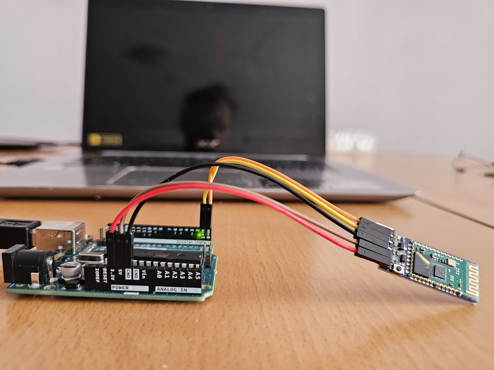
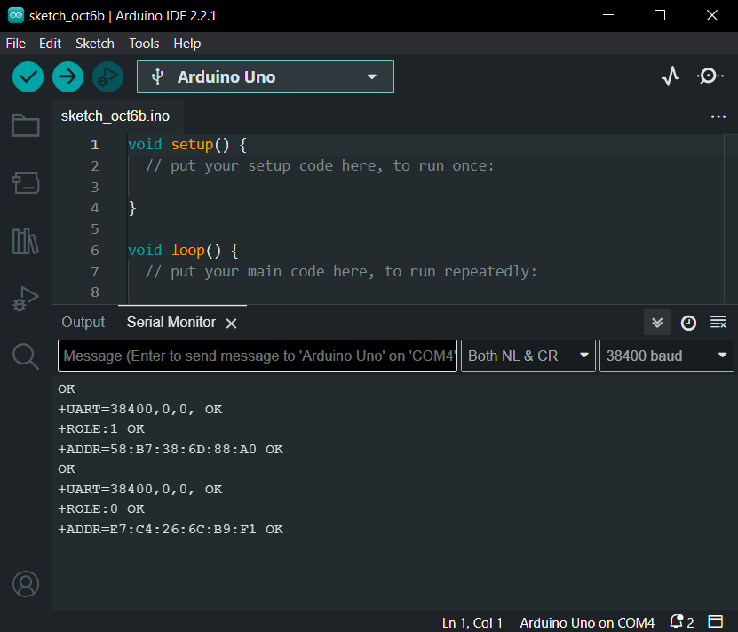
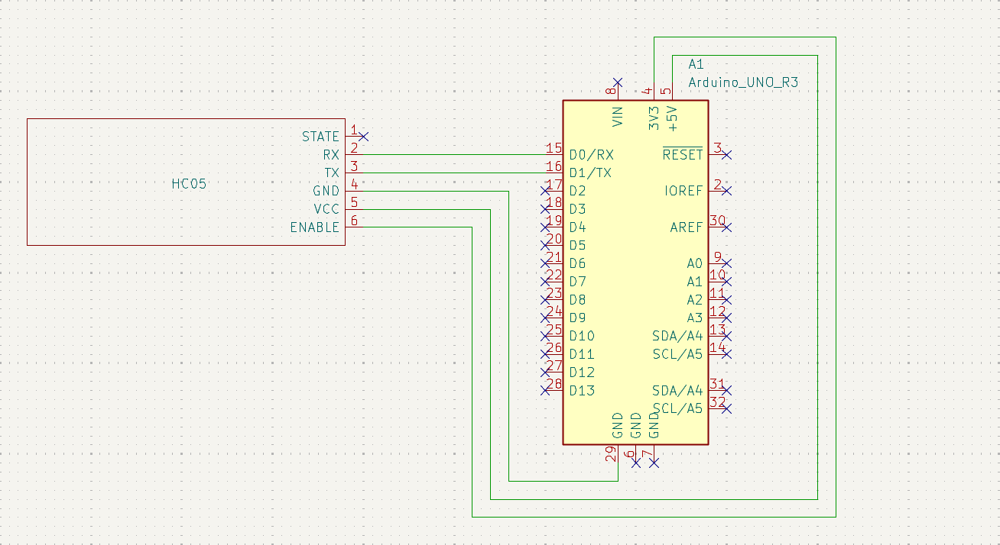

# HC05

This module is one of the more obvious choices for bluetooth communications. Thanks to its popularity on forums and projects alike, it is very hard to encounter an unsolvable problem with this module.
HC05 connects to the microcontroller via UART communication. In order to establish data transfer with a microcontroller, it first needs to be set up using the UART protocol. To simplify the process, HC05 is outfitted with 6 pins: STATE, RX, TX, GND, VCC and ENABLE.
There are also other pins which need to be soldered to the signal source but these are not crucial for standard use cases.

Setting of parameters can be visualized using any program dedicated to serial communication, but instead of installing another program I decided to use a spare Arduino board and IDE.
The configuration is done as follows:

* connect the GND, VCC and ENABLE pins of HC05 to GND, 5V and 3.3V pins of Arduino respectively
* upload an empty sketch to the Arduino board
* connect the RX and TX pins of HC05 and Arduino board
* open the Serial Monitor and select the "Both NL and CR" and "38400 Baud" options



The datasheet of HC05 lists all of the recognized commands as well as expected responses, but only few of them are essential to set up the module. Below is a list of those commands and expected responses:

* AT ->  OK
* AT+UART? -> 38400,0,0
* AT+ROLE? -> *role of the module, 0 for slave, 1 for master*
* AT+ADDR? -> *address of the module*

Note that the response for UART command is somewhat misleading: 38400 is the baud rate (data transfer speed) in bits per second, the first 0 indicates ONE stop bit, and the second 0 signifies NO parity bit. 
In my case the baud rate only applies to the configuration mode, while in the standard mode it defaults to 9600 baud rate and cannot be changed. This might depend on the firmware of the module.

To enable communication between two HC05 modules, one must be set up as a master, and one as a slave. This is done by sending the command "AT+ROLE=x", where x is 1 for the master, and 0 for slave.






## main.c
```C
/* Includes ------------------------------------------------------------------*/
#include "main.h"
#include "usart.h"
#include "gpio.h"

/* Private includes ----------------------------------------------------------*/
/* USER CODE BEGIN Includes */
#include "stm32f4xx_it.h"
/* USER CODE END Includes */

/* USER CODE BEGIN PV */
uint8_t rxData;
/* USER CODE END PV */

/* Private function prototypes -----------------------------------------------*/
void SystemClock_Config(void);
/* USER CODE BEGIN PFP */

int main(void)
{

  /* MCU Configuration--------------------------------------------------------*/

  /* Reset of all peripherals, Initializes the Flash interface and the Systick. */
  HAL_Init();

  /* Configure the system clock */
  SystemClock_Config();

  /* Initialize all configured peripherals */
  MX_GPIO_Init();
  MX_USART1_UART_Init();

  /* USER CODE BEGIN 2 */
  HAL_UART_Receive_IT(&huart1, &rxData, sizeof(rxData));
  /* USER CODE END 2 */

  /* Infinite loop */
  /* USER CODE BEGIN WHILE */
  while (1)
  {
    /* USER CODE END WHILE */

    /* USER CODE BEGIN 3 */
  }
  /* USER CODE END 3 */
}
```

## main.h
```C
/* USER CODE BEGIN Includes */
extern uint8_t rxData;
/* USER CODE END Includes */
```

## stm32f4xx_it.c
```C
/* Includes ------------------------------------------------------------------*/
#include "main.h"
#include "stm32f4xx_it.h"

/* USER CODE BEGIN 1 */
void HAL_UART_RxCpltCallback(UART_HandleTypeDef *huart)
{
	HAL_GPIO_WritePin(GPIOC, GPIO_PIN_13, rxData);

	HAL_UART_Receive_IT(&huart1, &rxData, sizeof(rxData));
}
/* USER CODE END 1 */
```
