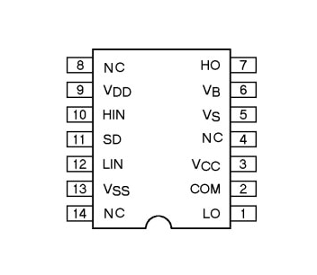

# Heater

This is the component which is regulated with signals coming from the microcontroller.
A thoirough research of all available heating components yields the 3D printer heater as the most suitable solution for this project.
It is basically a resistor coiled with a ceramic core and isolated with magnesium oxide with two long wires attached to each end, making it easy to generate heat at a safe distance from the rest of the circuit.
In this project I used a 40 Watt version.

Although this is the easiest solution for this type of device, it still requires a few workarounds to be properly integrated with the rest of the project:
* a 40 Watt source is needed, which means the Black Pill's 3.3 Volts and weak GPIO currents are not enough to power the heater
* ideal power supply for the heater would burn the Black Pill

This means that a power source of cca 40 Watts needs to be introduced and isolated from the rest of the circuit.
Both of these problems can be solved by using the powerful NMOS IRFZ44E. Its Gate pin is isolated from the Drain and Source pins, making it ideal for controlling dangerously high currents with a safe input on its Gate.

The IRFZ44E also introduces a problem: it is a voltage controlled NMOS and needs to receive a signal within 5-12V range. Since Black Pill's output is at 3.3V it is not possible to control the heater.

That would be true if MOSFET drivers do not exist, but as it turns out they do. I purchased IR2110 which takes the CMOS/TTL logic level as input and 5-12V as output.

