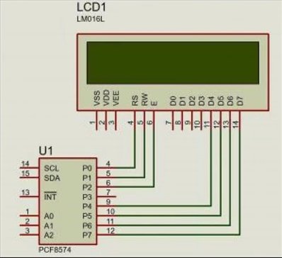
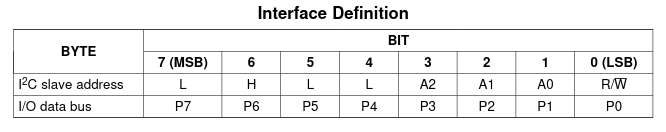
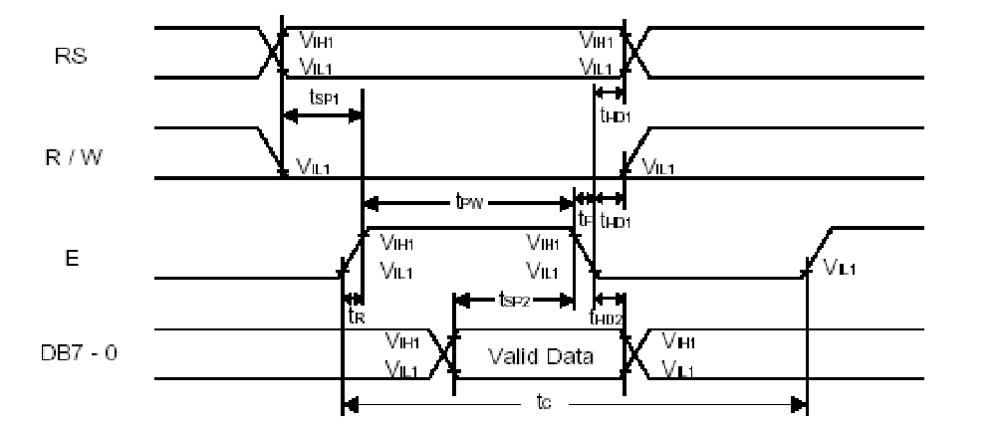

# 1602 LCD via I2C

This LCD screen is a very popular choice for prototyping as it can act as an interface for displaying all kinds of messages.
The version I am using in this project is outfitted with PCF8574, which drastically reduces wiring.

It is crucial to understand how the two modules are connected. Below is the diagram showing the connections.



It is worth mentioning that the user can only input the higher data bits (D4-D7), and instead of the lower half can manipulate the RS and RW pins to determine the type and direction of data: 
* RS: 0 = sending command, 1 = sending data
* RW: 0 = write, 1 = read. In this project, RW pin will always be 0
In all of the examples below, the sequence of user-defined data will be as shown on the graph:

The device itself has a unique protocol and requires a detailed look at the datasheet, but for simplicity's sake only the most important segments will be explained.

## Finding the address

First step is to determine the address of the device itself - since the microcontroller is actually connected to PCF8574, this module determines the address. Its value depends on multiple factors:

* the purpose of device (read/write)
* state of pins A2, A1 and A0



Since the device is used to write (send) data and pins are not soldered to the common ground by default, the address of the device is 0x4E.

## Wake up call

Using the diagram of the first chapter as refrence it is obvious that the lower 4 bits are actually used for sending commands to special pins of the LCD, unlike the upper half which is connected to data pins.
Different types of 4-bit groups introduces an unneccessary confusion, which can be easily avoided by implementing a correct input order based on the time diagram.



The function above is based on the time diagram from the LCD1602 datasheet and the wiring shown in the diagram with PCF8754 and LCD1602 . It shows that pins bits RS and RW must have a set value before a short pulse is sent to the EN pin.
The trigger for loading data bits is the falling edge of the EN pin.

```C

void lcd_send_cmd(char cmd)
{
	char data_u, data_l;
	uint8_t data[4];
	data_u = (cmd & 0xF0);
	data_l = ((cmd << 4) & 0xF0);
	
	data[0] = data_U | 0x0C; // EN=1, RS=0
	data[1] = data_u | 0x08; // EN=0, RS=0
	data[2] = data_l | 0x0C; // EN=1, RS=0
	data[3] = data_l | 0x08; // EN=0, RS=0
	
	HAL_I2C_Transmit(&hi2c1, 0x4E, (uint8_t)* data, 4, 100);
}

```

The same procedure is required to send data bytes and its function is almost the same as the one shown above, with the exception of the RS bit. In case of data byte, it needs to be 1, which would change the appended part of the byte from 0x08 and 0x0C to 0x09 and 0x0D.

The LCD1602 datasheet provides a detailed explanation of setting configuration on the screen. Before sending any data, the screen must be initialized following these steps:

* send 0x30 three times: wait x miliseconds between 1st and 2nd time, and more than 100 microseconds between 2nd and 3rd time
* set the device to 4-bit mode, enable both rows for displaying characters and adjust the font to 5x8 by sending 0x28
* turn off the LCD by sending 0x08
* clear the display with 0x01
* set the entry mode parameters to incrementing cursor and no shift by sending 0x06
* turn on the LCD by sending 0x08

## Displaying text

The LCD1602 has something called DDRAM. It is a special part of memory dedicated to storing letters. These values are sent to the CGROM (Character Generator ROM) to find the correct bitmap of the specified letter, which then gets displayed on the screen.
The DDRAM Address for the LCD1602 starts from the 0x80, so If we tell LCD to put the cursor at 0x80, it will basically put it in the beginning of the Top Row. Then the next Position will be 0x81, 0x82 and so on, upto 0x8F.

The beginning of the bottom row starts from 0xC0, and goes all the way upto 0xCF.

```C
void lcd_put_cur(row,col)
{
	if(row == 0){col |= 0x80;}
	else if(row == 1){col |= 0xC0;}
}
```

In case of sending a string, an iterating while loop can be used to repeatedly call the lcd_send_data() function:

```C
void send_string(char *string)
{
	while(*string){lcd_send_data(*string++);}
}
```

A good screen also has the ability to display absolutely nothing. To achieve this, one can send 0x01 command as shown in the datasheet.

```C
void lcd_clear(void)
{
	lcd_send_cmd(0x01);
	sleep(5);
}
```
